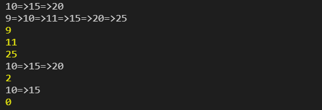

# 单向链表

#### 什么是单向链表

所谓链表是指一种常用的数据结构，通常由一系列结点组成，每个结点含两个信息域和指针域，信息域用于存放有关的数据项，指针域则用于指向链表的下一个结点。

##### 程序内部实现原理


#### 单向链表特性

1. 链表中的每个节点至少包含两个部分：数据域与指针域。
2. 链表中的每个节点，通过指针域的值，形成一个线性结构。
3. 查找节点O(n)，插入节点O(1)，删除节点O(1)。
4. 不符合快速的定位数据，适合动态的插入和删除数据的应用场景。

#### 单向链表实现方法

##### 使用javascript实现单向链表数据结构

首先我们需要一个辅助类，用来描述链表中的节点，这个类很简单，只需要两个属性，一个用来保存节点的值，一个用来保存指向下一个节点的指针。

```javascript
class Node {
  constructor(element) {
    this.element = element
    this.next = null
  }
}
```

链表类的基本骨架

```javascript
class LinkedList {
    constructor() {
        this.head = null;
        this.length = 0;
    }
    append(element) {} // 向链表中添加节点
    insert(position, element) {} // 在链表的指定位置插入节点
    removeAt(position) {} // 删除链表中指定位置的元素，并返回这个元素的值
    indeOf(element) {} // 在链表中查找给定元素的索引
    getElementAt(position) {} // 返回链表中索引所对应的元素
    isEmpty() {} // 判断链表是否为空
    size() {} // 返回链表的长度
    getHead() {} // 返回链表的头元素
    clear() {} // 清空链表
    toString() {} // 辅助方法，按指定格式输出链表中的所有元素。
}
```

让我们从查找链表元素的方法getElementAt()开始，因为后面我们会多次用到它。

```javascript
getElementAt(position) {
    // position不能超出边界值
    if (position < 0 || positon >= this.length) return null
    let cur = this.head
    for(let i=0; i<position; i++) {
        cur = cur.next
    }
    return cur
}
```

首先判断参数positon的边界值，如果值超出了索引的范围（小于0或者大于length -1），则返回null，我们从链表的head开始，遍历整个链表直到找到对应索引位置的节点，然后返回这个节点，是不是很简单？和所有有序数据集合一样，链表的索引默认从0开始，只要找到了链表的头（所以我们必须在LinkedList类中保存head值），然后就可以遍历找到索引所在位置的元素。

有了getElementAt()方法，接下来我们就可以很方便地实现append()方法，用来在链表的尾部添加新节点。

```javascript
append(element) {
    let node = new Node(element)
    // 如果当前链表为空，则将head指向node
    if (this.head === null) {
        this.head = node
    } else {
        // 否则，找到链表尾部的元素，然后添加新元素
        let current = this.getElementAt(this.length - 1)
        current.next = node
    }
    this.length += 1
}
```

如果链表的head为null（这种情况表示链表为空），则直接将head指向新添加的元素。否则，通过getElementAt()方法找到链表的最后一个节点，将该节点的next指针指向新添加的元素新添加的元素的next指针默认为null，链表最后一个元素的next值为null。将节点挂到链表上之后，不要忘记将链表的长度加1，我们需要通过length属性来记录链表的长度。

接下来我们要实现insert()方法，可以在链表的任意位置添加节点。

```javascript
insert (position, element) {
    // position不能超出边界值
    if (position < 0 || position >= this.length) return false;

    let node = new Node(element);

    if (position === 0) {
        node.next = this.head;
        this.head = node;
    }
    else {
        let previous = this.getElementAt(position - 1);
        node.next = previous.next;
        previous.next = node;
    }

    this.length++;
    return true;
}
```

首先也是要判断参数position的边界值，不能越界。当position的值为0时，表示要在链表的头部插入新节点，对应的操作如下图所示。将新插入节点的next指针指向现在的head，然后更新head的值为新插入的节点。


如果要插入的节点在链表的中间或者尾部，对应的操作如下图。假设链表长度为3，要在位置2插入新节点，我们首先找到位置2的前一个节点previous node，将新节点new node的next指针指向previous node的next所对应的节点，然后再将previous node的next指针指向new node,这样就把新节点挂到链表中了。考虑一下，当插入的节点在链表的尾部，这种情况也是适用的。而如果链表为空，即链表的head为null，则参数position会超出边界条件，从而insert()方法会直接返回false。


最后，别忘了更新length属性的值，将链表的长度加1.

按照相同的方式，我们可以很容易地写出removeAt()方法，用来删除链表中指定位置的节点。

```javascript
removeAt (position) {
    // position不能超出边界值
    if (position < 0 || position >= this.length) return null;

    let current = this.head;

    if (position === 0) this.head = current.next;
    else {
        let previous = this.getElementAt(position - 1);
        current = previous.next;
        previous.next = current.next;
    }

    this.length--;
    return current.element;
}
```

下面两张示意图说明了从链表头部和其它位置删除节点的情况。


如果要删除的节点为链表的头部，只需要将head移到下一个节点即可。如果当前链表只有一个节点，那么下一个节点为null，此时将head指向下一个节点等同于将head设置为null，删除之后链表为空。如果要删除的节点在链表的中间部分，我们需要找出position所在位置的前一个节点，将它的next指针指向position所在位置的下一个节点。总之，删除节点只需要修改相应节点的指针，使断开位置左右相邻的节点重新连接上。被删除的节点由于再也没有其它部分的引用而被丢弃在内存中，等待垃圾回收器来清除。有关JavaScript垃圾回收器的工作原理，可以查看[这里](https://developer.mozilla.org/zh-CN/docs/Web/JavaScript/Memory_Management )。

最后，别忘了将链表的长度减1。

下面我们来看看indexOf()方法，该方法返回给定元素在链表中的索引位置。

```javascript
indexOf (element) {
    let current = this.head;

    for (let i = 0; i < this.length; i++) {
        if (current.element === element) return i;
        current = current.next;
    }

    return -1;
}
```

我们从链表的头部开始遍历，直到找到和给定元素相同的元素，然后返回对应的索引号。如果没有找到对应的元素，则返回-1。

　　链表类中的其它方法都比较简单，就不再分部讲解了，下面是完整的链表类的代码：

```javascript
class LinkedList {
  constructor() {
    this.length = 0
    this.head = null
  }

  append(element) {
    let node = new Node(element)

    // 如果当前链表为空，则将head指向node
    if (this.head === null) this.head = node
    else {
      // 否则，找到链表尾部的元素，然后添加新元素
      let curr = this.getElementAt(this.length - 1)
      curr.next = node
    }

    this.length++
  }

  insert(position, element) {
    // position不能超出边界值
    if (position < 0 || position > this.length) return false

    let node = new Node(element)

    if (position === 0) {
      node.next = this.head
      this.head = node
    } else {
      let previous = this.getElementAt(position - 1)
      node.next = previous.next
      previous.next = node
    }

    this.length++
    return true
  }

  removeAt(position) {
    // position不能超出边界值
    if (position < 0 || position >= this.length) return null
    let curr = this.head

    if (position === 0) this.head = curr.next
    else {
      let previous = this.getElementAt(position - 1)
      curr = previous.next
      previous.next = curr.next
    }

    this.length--
    return curr.element
  }

  remove(element) {
    let index = this.indexOf(element)
    return this.removeAt(index)
  }

  indexOf(element) {
    let curr = this.head

    for (let i = 0; i < this.length; i++) {
      if (curr.element === element) return i
      curr = curr.next
    }

    return -1
  }

  getElementAt(position) {
    if (position < 0 || position >= this.length) return null

    let curr = this.head
    for (let i = 0; i < position; i++) {
      curr = curr.next
    }
    return curr
  }

  isEmpty() {
    // return this.head === null;
    return this.length === 0
  }

  size() {
    return this.length
  }

  getHead() {
    return this.head
  }

  clear() {
    this.head = null
    this.length = 0
  }

  toString() {
    let curr = this.head
    let result = []

    while (curr) {
      let next = curr.next
      next = next ? next.element : 'null'
      result.push(curr.element)
      curr = curr.next
    }
    return result.join('=>')
  }
}
```

　在isEmpty()方法中，我们可以根据length是否为0来判断链表是否为空，当然也可以根据head是否为null来进行判断，前提是所有涉及到链表节点添加和移除的方法都要正确地更新length和head。toString()方法只是为了方便测试而编写的，我们来看看几个测试用例： 

```
let linkedList = new LinkedList();
linkedList.append(10);
linkedList.append(15);
linkedList.append(20);
console.log(linkedList.toString());

linkedList.insert(0, 9);
linkedList.insert(2, 11);
linkedList.insert(5, 25);
console.log(linkedList.toString());

console.log(linkedList.removeAt(0));
console.log(linkedList.removeAt(1));
console.log(linkedList.removeAt(3));
console.log(linkedList.toString());

console.log(linkedList.indexOf(20));

linkedList.remove(20);

console.log(linkedList.toString());

linkedList.clear();
console.log(linkedList.size());
```

下面是执行结果： 



至此单向链表的相关工具类已经编写完毕，下节重点讲解链表的典型应用场景。

