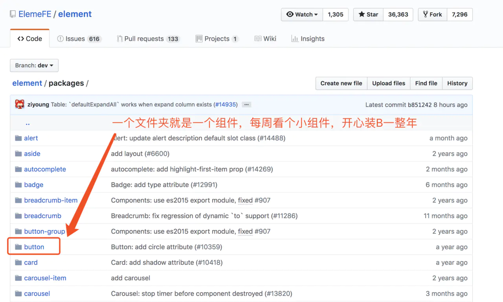
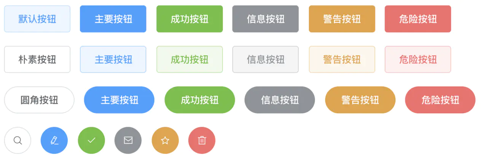

# Element-ui源码解析之button组件

#### 前言

我们肯定都想通过看组件库的源码（本章以Element为例）来拔高自己的水平，也肯定都尝试过，只是最终都不了了之罢了，这很正常，我也是这样的，其实对于功底一般的我们来说，看源码是需要方法和时间的：关于时间，我想每个星期看一个组件就足以（不用全部看完，挑着看就行），看自己安排；关于方法就是我接下来主要讲解的，这里以button组件为例 （因为它最简单实用），希望你看完之后能够有所启发。这里要注意一点，看源码之前其实还有一件很重要的事情要做，就是你应该要用过Element之类的组件库，这点很重要，**要先学会用，再去深究其原理。**

很多东西只是我们平时碰的比较少，因为陌生所以也觉得难。想想我们平时开发过程中写的组件，那个也是源码啊，只不过写的可能没有那么好就是了。

Element源码地址:[github.com/ElemeFE/ele…](https://juejin.cn/post/6844903812327538702) 

Element文档: [element-cn.eleme.io/#/zh-CN/com…](https://juejin.cn/post/6844903812327538702) 

#### 关于目录



由于本文的重点是讲解组件的具体思路，只要知道组件源码在哪里就行了，所以整体目录就先不说了，当然有兴趣的同学们可以看一下下面的这篇文章：

相关好文:[基于 vue-cli3 打造属于自己的 UI 库](https://juejin.im/post/6844903808787546125) 

#### 怎么看

**这里先简要说下我看组件源码的方法**，仅供大家参考。

首先Element有几个版本，我看的是基于Vue的版本，所以每个组件到底就是一个vue文件，就和我们平时工作写的代码一样，写好一个vue组件，然后在需要的页面引入即可。不过更重要的是要知道如何写好这个组件（健壮吗，可扩展吗，易维护吗等）。一个vue组件一般可分为三部分，template、script和style。在这里我们就不考虑style了，直接在页面引用Element的样式就好，因为这不是我们主要关心的，我们只要知道Element的样式一般是这样(el-组件名--状态，比如el-button--primary)命名的就行。所以我们组件里是没有写style部分的，这样做能帮我们省下好多时间和精力。

```javascript
// 直接在页面中引入 Element 的样式
<link rel="stylesheet" href="https://unpkg.com/element-ui/lib/theme-chalk/index.css">
```

#### 先看template部分

那么接下来我们就先看看template的部分怎么写。其实这部分是很简单的（对于这个组件来说），我们可以先打开Element文档看一下button的外观样式，再来写这部分，它大概长下面这样。



ok，假设你已经看过button组件的大部分外观，接下来我们就可以在脑海中先想一下（抽离并化简一下html结构的公共部分），大概就是一个**div**（button标签）里面包了一个**i**图标和**span**文件这样的结构，嗯好像是这样，那就试着写一个吧！（提示：Element组件一般最外层的样式都是用el-组件名 包起来的）

```html
<template>
  <button class="el-button">
    <i></i>
    <span></span>
  </button>
</template>
```

看上面的结构像那么回事，也简单明了。不过，然后呢。。。然后就是我们的script部分啦，这个才是组件的灵魂所在，重中之重，也是需要我们去啃的部分。好在这个组件简单，让我们继续往下看吧。

#### 再看script部分

我们看这部分的时候，可能无从下手，但其实还是有点门道的。不管神马组件，都有三个较为重要的组成部分：props、event和slot，这三个部分是组件对内对外沟通的桥梁，使得组件变得灵活起来。所以这三个api在发布之前一定构思好和确定好，因为后期再改就很难了，可以就是会牵一发动全身的样子。但后期对组件的处理其实不应该是这样的效果，而应该是不影响和改动之前的api,但又可以扩展和新增功能。ok，就让我们一个一个娓娓道来吧。首先看下props的部分，你需要在脑海中想象一下button组件的哪些内容是可变的（根据需要外部传参的改变而改变），不用着急往下看，先好好想一下。。。。。。

1. 最明显的就是button的背景色吧，这显然是可变的，就是type;

2. 然后是有没有图标，就是icon;

3. 还有就是有没有禁用，就是disabled;

4. 再来看有没有圆角，就是round;

5. 尺寸大小也是可变的，就是size;

6. 好像按钮还可以是文本的样子，就是plain;

   ......

   好了，那我们就试着写一下props部分吧！（注意:props的部分最好用对象的写法，这样能够对每个属性进行自定义设置，相比数组的写法，更为规范严谨)。

   ```html
   <script>
   export default {
     props: {
       type: {
         type: String,
         default: ''
       },
       size: {
         type: String,
         default: 'medium'
       },
       icon: {
         type: String,
         default: ''
       },
       disabled: Boolean,
       plain: Boolean,
       round: Boolean
     }
   }
   </script>
   ```

   接下来是slot部分，如果不懂slot用法的同学可以先出门左拐学习一下再来。很明显，对于button组件来说，文本就是slot啦，所以template里面的内容可以小改一下，代码如下：

   ```html
   <template>
     <button class="el-button">
       <i></i>
       <span><slot></slot></span>
     </button>
   </template>
   ```

   然后就是event部分，很显然啦，按钮能有什么功能呢，就是点击嘛，没了，所以它就一个事件，就是当按钮被点击的时候，我们需要触发一下事件向上传递，也就是$emit。于是乎，我们把事件添加到组件中，代码如下：

   ```html
   <template>
     <button
       class="el-button"
       @click="handleClick">
       <i></i>
       <span><slot></slot></span>
     </button>
   </template>
   <script>
   export default {
     props: {
       ...
     },
     methods: {
       handleClick (e) {
         this.$emit('click', e);
       }
     }
   }
   </script>
   ```

   好像event的部分就那么多，嗯，是的，比想像中的简单。。。。。。

   #### 再看template部分

   你以为组件写完了，不，并没有，你不觉得template里面太空了么，而且props这部分的属性都还没用上呢（只是声明了一下），所以我们还需要完善点东西。。。比如slot部分吧，通过$slots.default我们可以获取到slot中的内容，不过这里需要加个判断，因为用户可能没有传文字，那我们就不用渲染了；又比如图标i的部分，和slot一样，有传值我们才渲染，所以也加个判断（这里icon的值为el-icon-图标名格式）。

   ```html
   <template>
     <button
       class="el-button"
       @click="handleClick">
       <i :class="icon" v-if="icon"></i>
       <span v-if="$slots.default"><slot></slot></span>
     </button>
   </template>
   ```

   再看props中的属性，其实当中大部分都是用来控制样式变化的，比如type,size,round,disabled,plain等。。。所以就让我们为组件加上些class吧。

   ```html
   <template>
     <button
       class="el-button"
       @click="handleClick"
       :disabled="disabled"
       :class="[
         type ? 'el-button--' + type : '',
         size ? 'el-button--' + size : '',
         {
           'is-disabled': disabled,
           'is-plain': plain,
           'is-round': round
         }
       ]">
       <i :class="icon" v-if="icon"></i>
       <span v-if="$slots.default"><slot></slot></span>
     </button>
   </template>
   ```

   至此我们就写完了一个较为完整的button组件，是不是给人一种这么简单的么的感觉。虽然它还不够完善，但也覆盖了源码90%的部分，剩下的10%大家可以自己去补充补充。其实组件主要还是要看你思考得有多全面，想的越多写的越多。

   #### 结语

   顺着上面的思路，我们就可以有了较为明了的方法去看Element其它组件的源码（应该会轻松一些吧）。当然这里仅仅只是起一个抛砖引玉的作用，主要还是因为button确实简单还实用，很适合敲门砖的角色，当然也许后面看到其它复杂的组件你就不会这样想了。但是不管怎么说，好的开始是成功的一半，革命尚未成功，同志仍需努力。撸起袖子加油干吧！！！

   