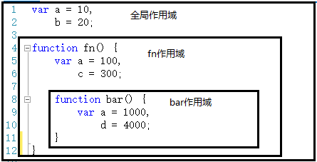

### 深入理解javascript原型和闭包—简介[作用域]

提到作用域，有一句话大家（有js开发经验者）可能比较熟悉:"javascript没有块级作用域"。所谓"块"，就是大括号"{}"中间的语句。例如if语句:

```javascript
var i = 10;
if (i > 1) {
    var name = 'albert'
}
console.log(name); // albert
```

再比如for语句：

```javascript
for (var i = 0; i<10;i++) {
    // ...
}
console.log(i); // 10
```

所以，我们在编写代码的时候，不要在”块“里面声明变量，要在代码一开始就声明好。以免发生歧义。 如：

```javascript
var i;
for (i = 0; i<10;i++) {
    // ...
}
console.log(i); // 10
```

其实，你光知道"javascript没有块级作用域"是完全不够的，你需要知道的是--**javascript除了全局作用域之外，只有函数可以创建的作用域。**

所以，**我们在声明变量时，全局代码要在代码前端声明，函数中要在函数体一开始就声明好。除了这两个地方，其他地方都不要出现变量声明。而且建议用"单var"形式。**

下面继续说作用域。作用域是一个很抽象的概念，类似一个”地盘“



如上图，全局代码和fn、bar两个函数都会形成一个作用域。而且，**作用域有上下级的关系，上下级关系的确定就看函数是在哪个作用域下创建的。**
例如，fn作用域下创建的bar函数，那么"fn作用域"就是"bar作用域"的上级。

**作用域最大的用处就是隔离变量，不同作用域下同名变量不会有冲突。**
例如以上代码中，三个作用域下都声明了"a"这个变量，但是他们不会有冲突。各自的作用域下，用各自的"a"。

> 下一节将把作用域和执行上下文环境结合起来说一说。