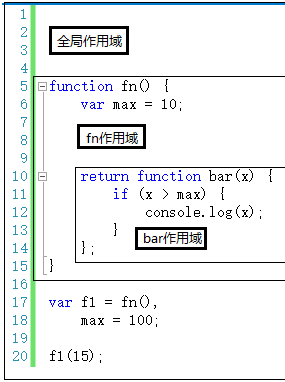
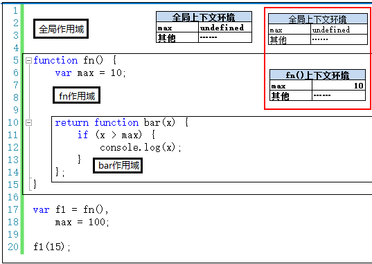

### 深入理解javascript原型和闭包—【闭包一】

前面提到的上下文环境和作用域的知识，除了了解这些知识之外，还是理解闭包的基础。

至于"闭包"这个词的概念的文字描述，确定不好解释，我看过很多遍，但是现在还是记不住。

**但是你只需要知道应用的两种情况即可--函数作为返回值，函数作为参数传递。**

**第一，函数作为返回值**

```javascript
function fn() {
    var max = 10;
    
    return function bar(x) {
        if (x > max) {
            console.log(x);
        }
    };
}
var f1 = fn();
f1(15);
```

如上代码，bar函数作为返回值，赋值给f1变量。执行f1(15)时，用到了fn作用域下的max变量的值。至于如何跨作用域，可以参考上一节。

**第二，函数作为参数被传递**

```javascript
var max = 10,
	fn = function (x) {
        if (x > max) {
            console.log(x);
        }
	};
	
(function (f) {
    var max = 100;
    f(5);
})(fn);
```

如上代码中，fn函数作为一个参数被传递进入另一个函数，赋值给f参数。执行f(15)时，max变量的取值是10，而不是100。

 上一节讲到自由变量跨作用域取值时，曾经强调过：**要去创建这个函数的作用域取值，而不是“父作用域”。**理解了这一点，以上代码中，自由变量如何取值应该比较简单。（不明白的朋友一定要去上一节看看，这个很重要！） 

另外，讲到闭包，除了结合着作用域之外，还需要结合着执行上下文栈来说一下。

在前面讲执行上下文栈时[深入理解javascript原型和闭包之[执行上下文栈] ][13.html]，我们提到当一个函数被调用完成之后，其执行上下文环境将被销毁，其中的变量也会被同时销毁。

但是在当时那篇文章中留了一个问号——有些情况下，函数调用完成之后，其执行上下文环境不会接着被销毁。这就是需要理解闭包的核心内容。

咱们可以拿本文的第一段代码（稍作修改）来分析一下。



第一步，代码执行前生成全局上下文环境，并在执行时对其中的变量进行赋值。此时全局上下文环境是活动状态。


第二步，执行第17行代码时，调用fn()，产生fn()执行上下文环境，压栈，并设置为活动状态。



第三步，执行完第17行，fn()调用完成。按理说应该销毁掉fn()的执行上下文环境，但是这里不能这么做。注意，重点来了：因为执行fn()时，**返回的是一个函数。函数的特别之处在于可以创建一个独立的作用域。**

而正巧合的是，返回的这个函数体中，还有一个自由变量max要引用fn作用域下的fn()上下文环境中的max。因此，这个max不能被销毁，销毁了之后bar函数中的max就找不到值了。 

因此，这里的fn()上下文环境不能被销毁，还依然存在与执行上下文栈中。

 ——即，执行到第18行时，全局上下文环境将变为活动状态，但是fn()上下文环境依然会在执行上下文栈中。另外，执行完第18行，全局上下文环境中的max被赋值为100。如下图：


第四步，执行到第20行，执行f1(15)，即执行bar(15)，创建bar(15)上下文环境，并将其设置为活动状态。


 执行bar(15)时，max是自由变量，需要向创建bar函数的作用域中查找，找到了max的值为10。这个过程在作用域链一节已经讲过。

这里的重点就在于，创建bar函数是在执行fn()时创建的。fn()早就执行结束了，但是fn()执行上下文环境还存在栈中，因此bar(15)时，max可以查找到。如果fn()上下文环境销毁了，那么max就找不到了。

**使用闭包会增加内容开销，现在很明显了吧！**

第五步，执行完20行就是上下文环境的销毁过程，这里就不再赘述了。

闭包和作用域、上下文环境有着密不可分的关系，真的是"想说爱你不容易"！

另外，闭包在jQuery中的应用非常多，在这里就不一一举例子了。所以，无论你是想了解一个经典的框架/类库，还是想自己开发一个插件或者类库，**像闭包、原型这些基本的理论，是一定要知道的。否则，到时候出了BUG你都不知道为什么**，因为这些BUG可能完全在你的知识范围之外。

到现在闭包就简单介绍完了，下节深入扩充一下对闭包的相关知识