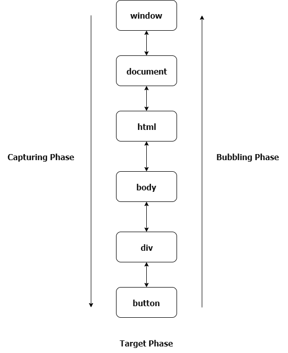

# 什么是事件传播？

> 回答者：[jianshe](https://github.com/jianshe)

***当事件发生在DOM元素上时，该事件并不完全发生在那个元素上。在"冒泡阶段"中，事件冒泡或向上传播至父级，祖父母或父级，直到到达window为止；而在"捕获阶段"中，事件从window开始向下触发元素、事件或event.targe。***

事件有三个阶段

+ 捕获阶段-事件从window开始，然后向下到每个元素，直到到达目标元素。
+ 目标阶段-事件已达到目标元素。
+ 冒泡阶段-事件从目标元素冒泡，然后上升到每个元素，直到到达window。
+ addEventListener方法具有第三个可选参数useCapture，其默认值为false，事件将在冒泡阶段中发生，如果为true,则事件在捕获阶段中发生。

