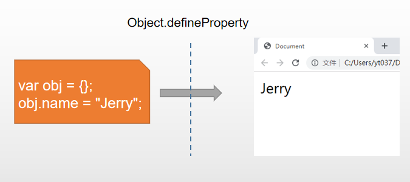
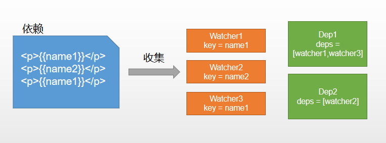

# 手写Vue源码

#### Vue工作流程

#### 初始化

初始化data、props、事件等

#### 挂载

执行编译，首次渲染、创建和追加过程

#### 编译

编译模块分为三个阶段：parse、optimize、generate

#### 数据响应式

渲染函数执行时会触发getter进行依赖收集，将来数据变化时会触发setter进行更新

#### 虚拟dom

Vue2开始支持Virtual DOM,通过JS对象描述dom，数据变更时映射为dom操作

```javascript
// dom
<div name="vuejs" style="color:red" @click="xx">
	<a> click me</a>
</div>
// vdom
{
    tag: 'div',
    props:{
        name:'vuejs',
        style:{color:red},
        onClick:xx
    }
    children: [
        {
            tag: 'a',
            text: 'click me'
        }
	]
}
```

#### 更新视图

数据修改时监听器会执行更新，通过对比新旧vdom，得到最小修改，就是patch

#### Vue2 响应式的原理：defineProperty



```html
<div id="app">
	<p>
       你好，<span id="name"></span>
    </p>
</div>
<script>
	var obj = {};
    Object.defineProperty(obj, "name", {
        get() {
            console.log("获取name")
            return document.querySelector("#name").innerHTML;
        },
        set(nickName) {
            console.log("设置name");
            document.querySelector("#name").innerHTML = nickName
        }
    })
    obj.name = "Jerry";
    console.log(obj.name)
</script>
```

#### 实现自己的Vue
简化版架构图


具体代码实现如下：

```javascript
//创建mvue.js
/**new MVue({
    data: {
        msg: "hello,vue"
    }
})**/
class MVue {
    constructor(options) {
        // 保存选项
        this.$options = options
        // 传入data选项
        this.$data = options.data
        //响应化
        this.observe(this.$data)
    }
    observe(value) {
        if (!value || typeof value !== "object") {
            return 
        }
        // 遍历，执行数据响应式
        Object.keys(value).forEach(key => {
            this.defineReactive(value, key, value[key])
        })
    }
    defineReactive(obj, key,val) {
        // 递归
        this.observe(val);
        // 给obj定义属性
        Object.defineProperty(obj, key, {
            get() {
                return val
            },
            set(newVal) {
                if (newVal === val) {
                    return
                }
                val = newVal
                console.log(`${key}属性更新了`);
            }
        })
    }
}
```

创建index.html

```html
<script src="mvue.js"></script>
<script>
	    const app = new MVue({
            data: {
                test: "I am test",
                foo: {
                    bar: "bar"
                }
            }
	    })
	    app.$data.test = "hello,vue.js"
	    app.$data.foo.bar = "oh my bar"
</script>
```

为$data做代理,mvue.js

```javascript
observe(value) {
    // ...
    Object.keys(value).forEach(key => {
        this.defineReactive(value, key, value[key])
        // 代理data中的属性到vue根上
        this.proxyData(key);
    })
}
// 在vue根上定义属性代理data中的数据
proxyData(key) {
    Object.defineProperty(this, key, {
        get() {
            return this.$data[key]
        },
        set(newVal) {
            this.$data[key] = newVal
        } 
    })
}
```

测试代码的变化 

```html
<script>
    app.test = "hello,vue.js";
	app.foo.bar = "oh my bar";
</script>
```

依赖收集与追踪



看下面案例，理出思路： 

```javascript
new Vue({
    template:
        `<div>
        <span>{{name1}}</span>
        <span>{{name2}}</span>
        <span>{{name1}}</span>
        <div>`,
    data: {
        name1: 'name1',
        name2: 'name2',
        name3: 'name3'
    },
    created(){
        this.name1="开课吧"
        this.name3="Jerry"
    }
});
```

创建Dep，mvue.js

```javascript
// mvue.js
class Dep {
    constructor() {
        //存放所有的依赖
        this.deps = []
    }
    // 在deps中添加一个监控器对象
    addDep(dep) {
        this.deps.push(dep)
    }
    // 通知所有监控器去更新视图
    notify() {
        this.deps.forEach(dep => dep.update())
    }
}
```

创建watcher,mvue.js

```javascript
// 监控器，负责更新视图
class Watcher {
    constructor(vm, key) {
        // 在new一个监听器对象时将该对象赋值给Dep.target，在get中会用到
        Dep.target = this
        this.vm = vm 
        this.key = key
    }
    // 更新视图的方法
    update() {
        console.log(`属性${this.key}更新了`)
    }
}
```

依赖收集，mvue.js

```javascript
 defineReactive(obj, key, val) {
     // 递归
     this.observe(val);
     
     // 每次defineReactive创建一个Dep实例
     const dep = new Dep()
     
     // 给obj定义属性
     Object.defineProperty(obj, key, {
         get() {
             // 将Dep.target（即当前的watcher对象存入Dep的deps中）
             Dep.target && dep.addDep(Dep.target)
         	return val
         },
         set(newVal) {
             if (newVal === val) {
             	return
             }
            // val = newVal
            // console.log(`${key}属性更新了`);
             // 在set的时候触发dep的notify来通知所有的watcher对象更新视图
             dep.notify()
         }
     })
}
```

测试代码

```javascript
class KVue {
    constructor(options) {
        // ...
        // 新建一个Watcher观察者对象，这时候Dep.target会指向这个Watcher对象
        new Watcher(this, 'test');
        // 访问get函数，为了触发依赖收集
        this.test
        
        new Watcher(this, 'foo.bar');
        this.foo.bar
    }
}
```

#### 编译器compile

核心任务:

1. 获取并遍历DOM树
2. 文本节点：获取{{}}格式的内容并解析
3. 元素节点：访问节点特性，截获k-和@开头内容并解析

##### 目标功能

```html
<body>
  <div id="app">
    <p>{{name}}</p>
    <p k-text="name"></p>
    <p>{{age}}</p>
    <p>
      {{doubleAge}}
    </p>
    <input type="text" k-model="name">
    <button @click="changeName">呵呵</button>
    <div k-html="html"></div>
  </div>
  <script src='./compile.js'></script>
  <script src='./mvue.js'></script>
  <script>
    const mvue = new MVue({
      el: '#app',
      data: {
        name: "I am test.",
        age: 12,
        html: '<button>这是一个按钮</button>'
      },
      created() {
        console.log('开始啦')
        setTimeout(() => {
          this.name = '我是测试'
        }, 1500)
      },
      methods: {
        changeName() {
          this.name = '哈喽,Vuejs'
          this.age = 1
        }
      }
    })
  </script>
</body>
```

#### compile.js

根据节点类型编译，compile.js

```javascript
// 1. 获取并遍历DOM树
// 2. 文本节点：获取{{}}格式的内容并解析
// 3. 元素节点：访问节点特性，截获k-和@开头内容并解析
// new Compile('#app', vm)
class Compile {
  constructor(el, vm) {
    this.$vm = vm;
    this.$el = document.querySelector(el);

    if (this.$el) {
      // 执行编译
      this.compile(this.$el);
    }
  }

  compile(el) {
    // 遍历el
    const childNodes = el.childNodes;
    // 每次拿出一个dom节点
    Array.from(childNodes).forEach(node => {
      // 判断节点类型
      if (this.isElement(node)) {
        // 3. 元素节点：访问节点特性，截获k-和@开头内容并解析
        // console.log('编译元素'+node.nodeName);
        this.compileElement(node);
      } else if (this.isInter(node)) {
        // 2. 文本节点：获取{{}}格式的内容并解析
        // console.log('编译插值文本'+node.textContent);
        this.compileText(node);
      }

      // 递归
      if (node.childNodes && node.childNodes.length > 0) {
        this.compile(node);
      }
    });
  }

  isElement(node) {
    return node.nodeType === 1;
  }
  // 判断是否是插值表达式
  isInter(node) {
    return node.nodeType === 3 && /\{\{(.*)\}\}/.test(node.textContent);
  }

  // 编译插值文本
  compileText(node) {
    // 获取表达式
    // {{a+b()}}
    const exp = RegExp.$1;
    this.update(node, exp, "text");
  }

  // 通用方法 update(node, 'xxx', 'text')
  update(node, exp, dir) {
    // 构造更新函数并执行：相当于首次赋值
    let updaterFn = this[dir + "Updater"];
    updaterFn && updaterFn(node, this.$vm[exp]);

    // 创建watcher，执行后续更新操作
    // 额外传递一个更新函数：能够更新指定dom元素
    new Watcher(this.$vm, exp, function(value) {
      updaterFn && updaterFn(node, value);
    });
  }

  textUpdater(node, value) {
    node.textContent = value;
  }

  compileElement(node) {
    // 获取属性
    const nodeAttrs = node.attributes;
    Array.from(nodeAttrs).forEach(attr => {
      //   k-text="test"
      const attrName = attr.name; // k-text
      const exp = attr.value; // test

      if (attrName.indexOf("k-") === 0) {
        // 指令 k-text k-model
        const dir = attrName.substring(2); // text
        this[dir] && this[dir](node, exp);
      }
    });
  }

  text(node, exp) {
    this.update(node, exp, "text");
  }
}
```

更新Watcher,mvue.js

```javascript
class Watcher {
    constructor(vm, key, cb) {
        this.vm = vm;
        this.key = key;
        //传入更新函数cb
        this.cb = cb;
        // 设定将当前Watcher实例到Dep.target
        Dep.target = this;
        this.vm[this.key]; // 读取vm的属性触发依赖收集
        Dep.target = null;
    }
    // 更新
    update() {
        // comsole.log('视图更新啦！')；
        this.cb.call(this.vm, this.vm[this.key]);
    }
}
```

测试代码

```javascript
class KVue {
    constructor(options) {
        // 保存选项
        this.$options = options;
        // 保存data
        this.$data = options.data;
        // 对传入data对象执行响应化处理
        this.observe(this.$data);
        // 测试
        // new Watcher(this, 'test')
        // this.test; // 读取属性，触发依赖收集
        
        new Compile(options.el, this);
        if(options.created) {
            options.created.call(this)
        }
    }
}
```

#### 拓展

数据响应化怎么做

首先数据响应化也是以k开头的指令:k-model

添加k-model指令相当于给当前节点的input事件进行监听，当键盘敲下时就改变input输入框指定的值

具体实现compile.js中添加model方法

```javascript
// compile.js 
model(node, exp) {
    // 1.执行更新
    this.update(node, exp, 'model')
    // 2.事件监听
    node.addEventListener('input', e=> {
        this.$vm[exp] = e.target.value
    })
}
```


#### 如何实现k-html、@click

k-html指令就相当于将v-html引用的data属性的值赋值给当前节点 

@click指令相当于给当前节点添加click事件，并从选项的methods对象中获取回调函数，并执行

具体代码实现如下：

compile.js中添加htmlUpdater、eventHandler

```javascript
htmlUpdater(node, value) {
    node.innerHTML = value
}
eventHandler(node, exp, dir) {
    // 获取回调函数
    const fn = this.$vm.options.methods && this.$vm.$options.methods[exp];
    if (dir && fn) { // 如果用户有监听事件并且fn也存在
        node.addEventHandler(dir, fn.bind(this.$vm));
    }
}
```

至此简单版的vue流程已实现完成，还有很多可以添加的指令和优化点，有兴趣的同学可以完善更多功能。

