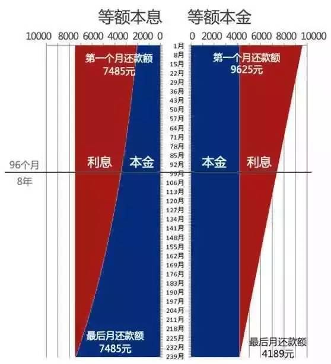
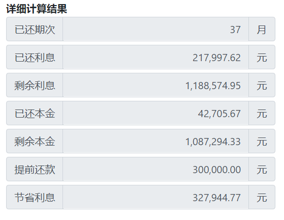
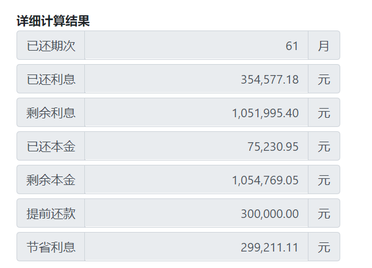
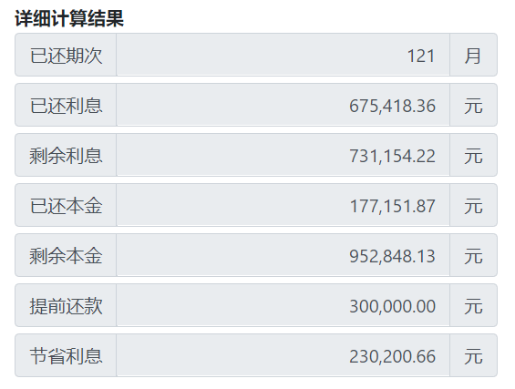
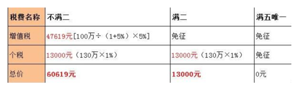
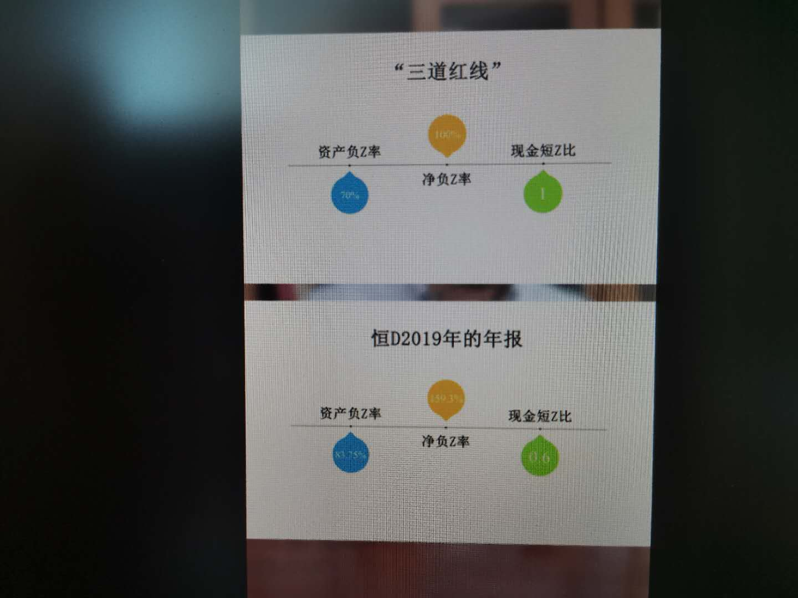

### **深入理解房产相关知识及买卖规则**

#### 关于楼盘选择

+ 选大不选小
+ 选近不选远
+ 只信现在拒绝承诺
+ 样板间都是骗人的

##### 需要注意开发商的资质

+ 最好选规模大、知名度高的开发商。主要是出现纠纷好维权

+ 五证是否齐全:

  即“建设用地规划许可证”，“建设工程规划许可证”，“建设工程开工证”，“国有土地使用证”，和“商品房预售许可证”。 

#### 关于位置选择

- 自住

  选择居住区

  周边配套

  学校>商业>医疗

  避开污染严重的地方

- 投资

  升值快、不一定住的舒服的地方

#### 关于楼层选择

+ 一般10楼开始到20多楼是价格最高的，这个看个人经济能力，我觉得不低于8楼就好，太低的话开窗小区里的小孩子玩耍的声音和大人聊天会吵得心烦。
+ 15到25是黄金楼层，每层楼向上递增大概每平米30到60元的差价。

#### 关于贷款

- 个人住房公积金贷款

  限有公积金的职工，可选择公积金贷款。公积金贷款不仅低于同期商业贷款利率，还低于同期商业银行存款利率 ，和银行贷款利率之间存在一个利差。

  **但如果买房地和公积金交纳地不一致，如在上海缴纳的公积金，你要在郑州买房是不允许使用的**

- 个人住房商业性贷款

  个人商业贷款限定的条件比较多，没有住房公积金的购房者就可申请这种方式，但申请商业贷款需要在贷款银行存款余额占购买住房所需资金额的比例不低于30%，且有贷款银行认可的资产作为抵押。 

- 个人住房组合贷款

  公积金贷款能贷多少，各地政策不一，且差别巨大，但主要取决于公积金账户余额、缴存年限、月缴公积金额度、贷款人年龄。一般单人最高贷款50万左右，夫妻100万左右。 如果所购房屋的房款超过了这个限额，其他部分要向银行申请商业贷款的，就称为组合贷款。 

#### 关于还款方式

+ 等额本息

  **本金逐月递增，利息逐月递减，月还款数不变。**  

+ 等额本金：

  **本金保持相同，利息逐月递减，月还款数递减；** 

  如下图：

  

#### 关于房屋买卖

+ 提前还款，什么时候还最好？为什么？

  我们假设：贷款113万，利率上浮30%，即:6.37%。等额本息30年。30年的利息是：1406572.58万元。

  第一，假设第3年开始提前还款30万，看能减少多少月供和利息；月供由7046.03元减少到 5,101.93 元。节省利息：327,944.77元

  

  第二，假设第5年开始提前还款30万，看能减少多少月供和利息；月供由7046.03元减少到 5,041.98元 。节省利息：299,211.11元

  

  第三，假设第10年开始提前还款30万，看能减少多少月供和利息；月供由7046.03元减少到 4,827.62 元。节省利息：230,200.66元

  

  由上面3个图可以看出来：从第3年开始到第10年，月供基本上变化不大。利息节省较大。

  综上所述：第2年或者第3年如果有30万可以提前还款。因为此时间段月供减少的最多，利息节省的也是最多的。

  提前还清房贷口决：

  **等额本金20年第5年之前还，等额本金30年第7年之前还；**

  **等额本息20年第6年之前还，等额本息30年第8年之前还。**

+ 满五唯一和满二唯一

  根据目前国家相关税费规定，二手房买卖交易过程中，买方主要需承担**契税**、**产权转移登记费**，卖方主要需承担**营业税**、**个人所得税**，而且**满五年**的，**免征营业税**，**满五年且唯一(以家庭为单位)**的，**免征个人所得税**。同时，在目前二手房交易市场中，经买卖双方协商后，一般交易所需税费均由买受人实际负担，出卖人所获得的购房款通常是不含税费的净价。

  **"满五唯一"**

  > "满五唯一"的房子在二手房市场是非常受欢迎的，原因就是税费非常便宜，比新房交的费用更少。

  二手房在过户时会产生３个税种：契税、个税和增值税。其实还有一个印花税，但是这个印花税费用很少，可以忽略不计。

  + 契税

    **家庭首套房**90平米及以下为1%，**90平米以上1.5%**。家庭二套房90平米及以下1%，90平米以上2%。家庭三套房及以上不再看房屋的面积，直接按3%计算。其实住宅的契税是享受了优惠政策的，实际的契税为3%-4%，**40年产权的公寓、写字楼、商铺不看套数和面积，直接按3%计算。**

  + 个税

    直接按照**1%**计算，也有部分城市按照现值-原值的差额20%计算。

  +  增值税

    增值税为以前的营业税，也就是“营改增”，税率其实并没有什么变化，直接按**5.6%**即可。 

  其实从上面的税种和税率可以看出 ，二手房的过户税率是很高的，特别是增值税，达到了5.6%。房管局规定只要交易的二手房**满了两年**，就**免交增值税**，所以免交增值税的条件还是很好达到的。如果交易的二手房**满了五年**，而且是**房东家庭的唯一住房**，这就是所谓的"满五唯一"， 这种情况下**免交个人所得税和增值税**，只用交契税即可。

  而新房需要交纳契税和维修基金，所以"满五唯一"的二手房所交的税费比新房所交的费用更少。比较受欢迎。这也就是为什么买卖房产五年后买卖比较划算。

  **"满二唯一"**

  这是最近新出的名词，是因为最近国家税费调整，增值税改为两年为界限，满二唯一的房子可以减免一些增值税，但是需要正常交纳个税。但是由于购买时间较近，当时房屋购买原值相对比较高，差额的个税相对比较低，同是若房子为非普的话，差额增值税也会相对比较低。

  **友情提示：**

  **房屋增值税计算:个人将购买不足2年的住房，不管是否是普通住宅对外销售的,按照5%的征收率全额缴纳增值税;** 

  注**：购买房价是含税价，除以1.05换算为不含税价。**

  

+ 怎么转让有贷款的房子? 

  **根据目前国家相关税费规定，新买的房子，持有五年之后，出手比较划算。**

  **转让方式**：

  1.转按揭最简单直接的一种方法，在二手房买卖中通俗的讲就是把个人住房出售或转让给第三人而申请办理个人住房贷款变更借款期限、变更借款人或变更抵押物的贷款。 

  2.用买方的首付款缴清剩余贷款这是当下二手房交易中最多应用的模式。 

  3.利用银行贷款来缴清剩余贷款如果卖方想在卖出房产之前将贷款还清或买方虽然看好但不愿意购买贷款未缴清的房产，可以采取这种方式。但前提是房主有银行认可的抵押物(如其他房产)用来申请贷款。这样房主就可以通过抵押向银行贷出一定的款来付清想要出售的房产贷款，促成交易的成功。 

  4.卖方还清房贷后解押出房产，与买方完成交易，拿到买方支付的款项之后，再将抵押给银行的抵押物解押，最终完成整个交易。 

> 恒大全国7折卖房，房价要降了吗？

​              2020年8月20日住建部、央行约谈了多家开发商，明确提出了收紧开发商融资的"三道红线"。

１.资产负Z率不得大于70%；

２.净负Ｚ率不得大于100%;

3.现金短Z比要大于1；

  

结合恒D2019年的年报

  

三条都踩线了，如果再不降下来，明年以恒D就不能借钱了，对于高周转的房企，如果不能借钱了，就相当于废掉了。降价的不止有恒D：

还有中国恒D、融C中国、绿D控股、华X幸福、富L地产、泰H集团、华F股份、三S股份、金R街和中T金融，全部踩了三道红线，下半年一定会掀起降J狂潮。

对于买房的人来说，其实是好事。如果还想买房可以抓住这个阶段性的抄底机会，但泰H和绿D资金链貌似已断，有些项目已经停工，不建议购买这两个楼盘。

> 清风徐来，水波不兴；内心平静于水，方能归故乡。

